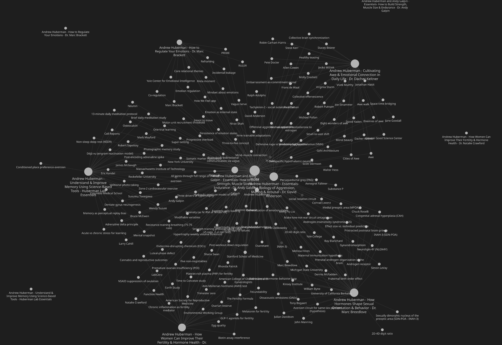

# podcast-llm-wiki

Ingest YouTube podcast playlists, transcribe locally with diarization, and
compound the results into a per-podcast [Karpathy-style LLM Wiki](https://gist.github.com/karpathy/442a6bf555914893e9891c11519de94f)
inside an Obsidian vault.



## What it is

```
┌──────────── TIER 1: AUTOMATED (cron-able, no LLM) ────────────┐
│  yt-dlp ──► audio ──► faster-whisper + pyannote ──► diarized .md │
│                                                                │
│  Output: transcription + collected.md + analysis_queue.md      │
└────────────────────────────────────────────────────────────────┘
                               │
                               ▼
┌──── TIER 2: HUMAN-IN-LOOP (Claude Code session) ──────────────┐
│  /analyze-podcast → structured analysis + Obsidian vault      │
│  update (entities, concepts, episodes, index, log)            │
└────────────────────────────────────────────────────────────────┘
```

The pipeline is a thin Python tool that downloads and transcribes; the
analysis layer runs inside [Claude Code](https://docs.claude.com/en/docs/claude-code/overview)
via a shipped slash command. This split keeps the heavy lifting local and
free, and uses Opus quota only for analysis.

## Why

Most podcast tooling produces one-off summaries that vanish after you read
them. The Karpathy LLM Wiki pattern compounds knowledge: every new episode
adds entities, concepts, and cross-references to a personal knowledge base
that grows more useful over time. This project applies that pattern to
podcasts: each episode you ingest enriches the vault, surfaces contradictions
across episodes, and builds a graph of how the topics interrelate.

## Quickstart

### Prerequisites

- Python 3.11+
- `ffmpeg` (`apt install ffmpeg` / `brew install ffmpeg`)
- (Optional) NVIDIA GPU with CUDA, or Apple Silicon with MPS — speeds up transcription
- [Claude Code](https://docs.claude.com/en/docs/claude-code/overview)
- [Obsidian](https://obsidian.md/) for browsing the wiki

### Install

```bash
git clone https://github.com/geoffreybyers/podcast-llm-wiki.git
cd podcast-llm-wiki
pip install -e ".[dev]"

cp podcasts.yaml.example podcasts.yaml
# edit podcasts.yaml with your playlists
```

### HuggingFace access (only if you enable diarization)

Skip this section if you're running with `diarization: false` — transcription
with faster-whisper does not need a HuggingFace token.

The pyannote diarization pipeline loads **three** separate gated repositories.
You must accept the license on each (same HF account). Metadata fetches
succeed the instant you click "Accept"; actual weight downloads unlock a few
seconds later.

1. Create an account at https://huggingface.co/.
2. Accept the license on each of these (follow the link, click "Agree and
   access"; fill the contact form if shown):
   - https://huggingface.co/pyannote/speaker-diarization-3.1 — the pipeline
   - https://huggingface.co/pyannote/segmentation-3.0 — segmentation backbone
   - https://huggingface.co/pyannote/speaker-diarization-community-1 —
     speaker embedding + PLDA weights
3. Generate a read-scope token at https://huggingface.co/settings/tokens.
4. Put it in a `.env` file at the repo root:

   ```bash
   cp .env.example .env
   # then edit .env and paste your token after HF_TOKEN=
   ```

   `.env` is gitignored. `podcast-llm-wiki` loads it automatically on startup, so
   the same file works from an interactive shell and from cron.

Why three? pyannote's `speaker-diarization-3.1` pipeline delegates to a
separate segmentation model and a separate embedding/PLDA model; each is a
distinct HF repo with its own license prompt. If you skip any, the pipeline
crashes with `GatedRepoError` on first use.

### First run (smoke test on one episode)

```bash
python -m podcast_llm_wiki ingest --limit 1 --podcast "Your Podcast Name"
```

`--limit 1` caps each podcast at one new episode per run. Combined with
`--podcast` (which scopes the run to a single entry from `podcasts.yaml`),
this downloads exactly one episode, transcribes it (slow on CPU; ~real-time
on a modest GPU), and adds it to `collected.md` and `analysis_queue.md`.

### Analyze in Claude Code

```bash
cd /path/to/podcast-llm-wiki
claude  # opens Claude Code in the project directory
```

Then in the Claude Code session:

```
/analyze-podcast
```

The first time you run this for a podcast, it creates the Obsidian vault
under `~/obsidian/<Podcast Name>/`. Open that directory in Obsidian to
browse the wiki.

## Configuration reference

See `podcasts.yaml.example` for the annotated schema. Top-level structure:

```yaml
defaults:
  vault_root: ~/obsidian       # where vaults are created
  max_backfill: 20             # episodes to backfill on first run
  stt_model: small.en          # faster-whisper model
  diarization: true            # pyannote diarization on/off
  diarization_segmentation: pyannote-segmentation-3.0
  diarization_embedding: 3d-speaker

podcasts:
  - name: "Display Name"
    playlist_url: "https://www.youtube.com/playlist?list=..."
    vault_path: ~/custom/path  # optional; defaults to vault_root/name
    lens: |
      Multi-line analytical lens guiding the /analyze-podcast prompt.
    # Any default may be overridden per-podcast.
```

## The `/analyze-podcast` slash command

When run in Claude Code at the project root:

- `/analyze-podcast` — pop and analyze the next queued transcription (1 episode).
- `/analyze-podcast 5` — analyze the next 5.
- `/analyze-podcast --match huberman-sleep` — find a queued transcription
  whose filename matches `huberman-sleep` and analyze it.

The slash command:

1. Reads the per-podcast lens from `podcasts.yaml`.
2. Generates a structured analysis (TL;DR, Key Insights, Critical Pass with
   1–3 steelmans, strict-format Entities/Concepts, Follow-ups).
3. Writes the analysis file to `podcasts/<podcast>/analyses/`.
4. Updates the Obsidian vault: copies the transcription to `raw/transcripts/`,
   writes the episode page, upserts entity/concept pages, updates `index.md`
   and `log.md`.
5. Marks the episode `analyzed` in `collected.md` and removes it from the queue.

### Writing a good lens

The lens is a free-text fragment prepended to the analysis prompt. It should
say:

- The dominant frame for insights (e.g. "biological mechanisms with evidence quality").
- What's signal vs. noise for this podcast (e.g. "panel disagreements ARE the signal").
- Per-podcast extraction rules (e.g. "for guests, capture formative experiences").

See `podcasts.yaml.example` for a generic starting point. Iterate based on
the first 2–3 analyses.

## Wiki structure

Each podcast gets its own Obsidian vault following the Karpathy LLM Wiki
pattern with one addition (`episodes/`):

```
<vault>/
├── SCHEMA.md          ← domain + lens + tag taxonomy
├── index.md           ← catalog, sectioned by type
├── log.md             ← append-only action log
├── raw/transcripts/   ← copies of transcription files (immutable)
├── episodes/          ← one page per analyzed episode
├── entities/          ← people, orgs, studies, products
├── concepts/          ← ideas, mechanisms, frameworks
├── comparisons/       ← cross-episode analyses (manual or via slash command)
└── queries/           ← filed query results worth keeping
```

See `docs/wiki-schema-template.md` for the per-vault `SCHEMA.md` template.

## Operations

### Cron setup

```cron
# Hourly check for new episodes
0 * * * * cd /path/to/podcast-llm-wiki && /usr/bin/python -m podcast_llm_wiki ingest >> logs/cron.log 2>&1
```

### Multi-GPU hosts

If your box has multiple GPUs, **set `CUDA_DEVICE_ORDER=PCI_BUS_ID`** in your
shell rc or service unit file. CUDA's default is `FASTEST_FIRST`, which can
reorder devices so that `CUDA_VISIBLE_DEVICES=2` does not land on the card
`nvidia-smi` calls "GPU 2". Setting `PCI_BUS_ID` aligns CUDA enumeration
with `nvidia-smi`, which is what you almost always want.

```bash
# ~/.zshrc or ~/.bashrc
export CUDA_DEVICE_ORDER=PCI_BUS_ID
```

Multi-worker parallelism (`--workers N` with per-GPU locks) is planned but not
yet implemented. Current runtime is single-worker. Track progress in the
roadmap below.

### Recovering from failures

- `download_failed`: the row in `collected.md` records the error. Re-running
  the pipeline will retry on the next ingest.
- `transcription_failed`: same — re-runs retry up to 3 times before parking
  the episode for manual review.
- Re-do an analysis: delete the analysis file, clear the `analyzed_at` field
  in `collected.md` for that row, re-add the transcription path to
  `analysis_queue.md`, then `/analyze-podcast`.

## Roadmap / non-goals

**Planned but not built yet:**
- `/lint-vault` slash command (orphan pages, broken wikilinks, etc.)
- Cross-vault meta-vault for cross-podcast synthesis

**Explicit non-goals:**
- Web UI / TUI / dashboard. `collected.md` opened in Obsidian is the dashboard.
- Email / Slack / push notifications.
- Real-time / live transcription.
- Non-YouTube ingestion (RSS, Spotify, Apple).

## License & responsibility

MIT. See `LICENSE`.

**Use responsibly:** `yt-dlp` may violate YouTube's ToS depending on
jurisdiction. Transcripts of copyrighted podcasts are for personal use only;
do not redistribute. The `pyannote/speaker-diarization-3.1` model has an
academic license requiring HuggingFace acceptance.
